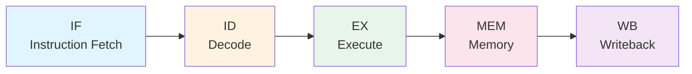
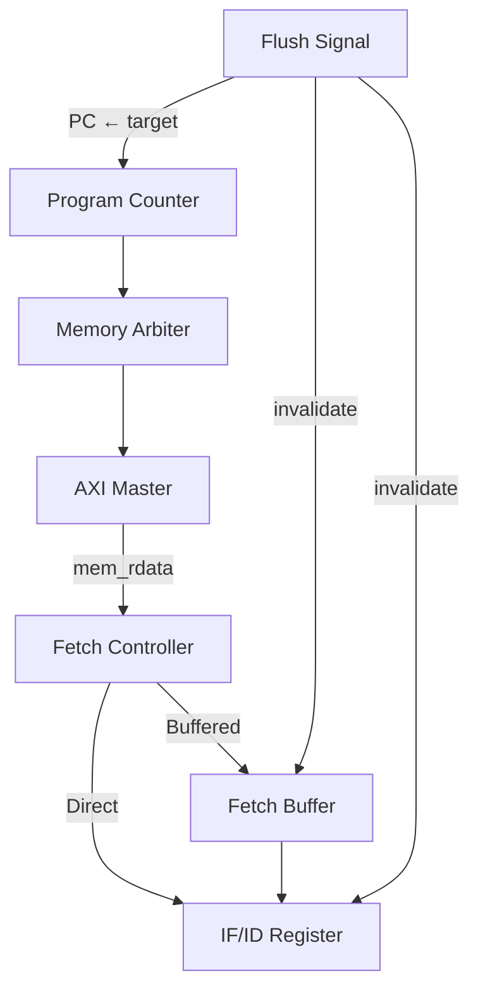
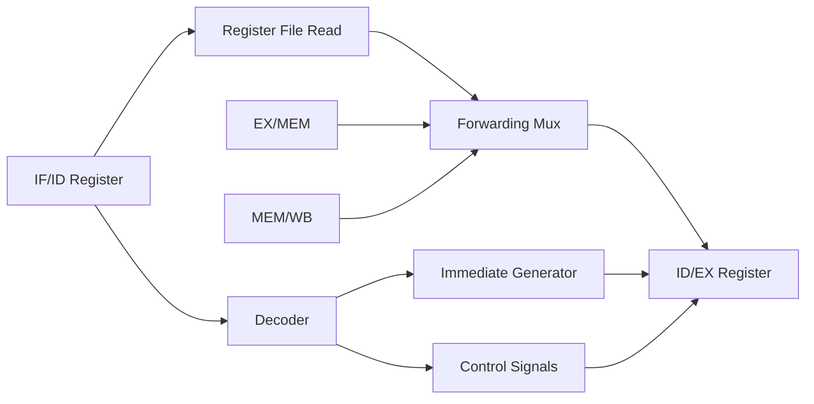
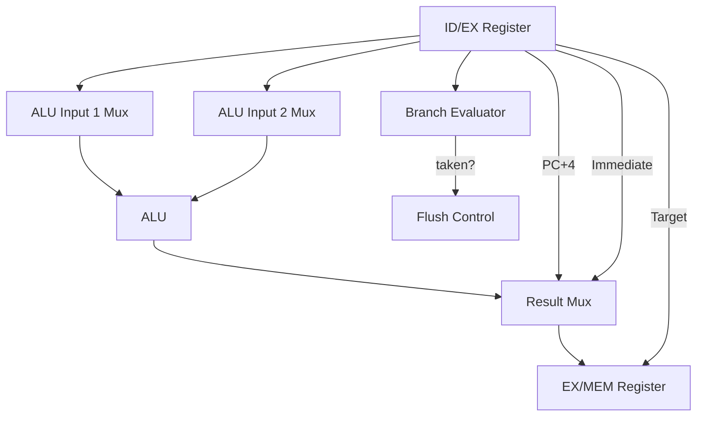
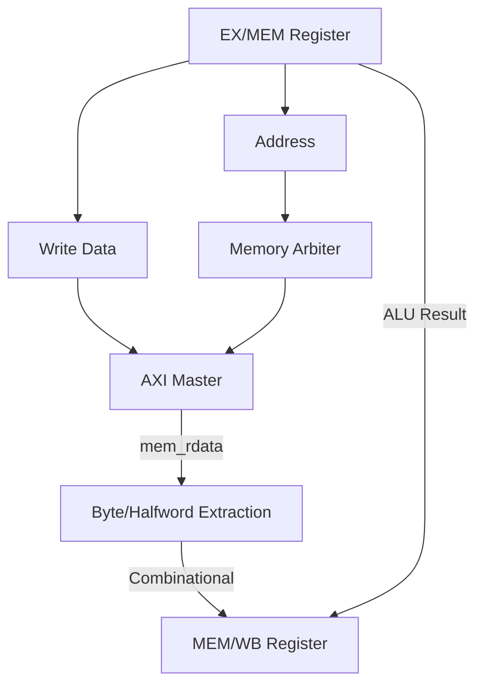
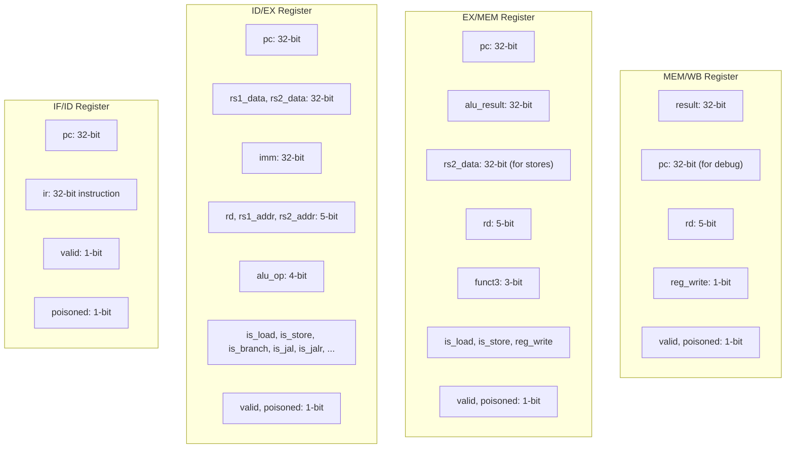
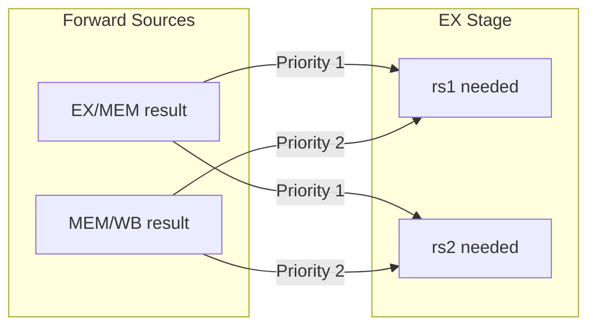
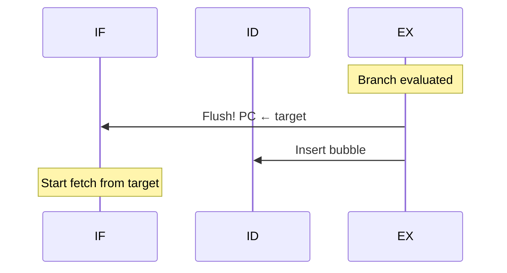
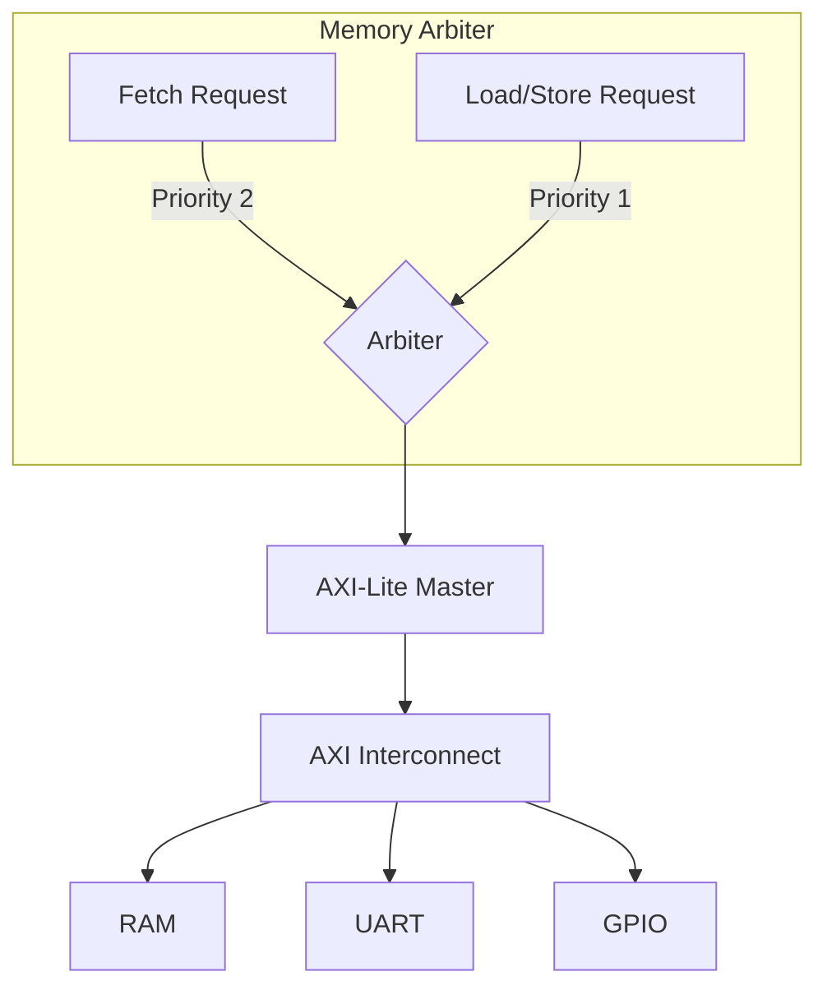
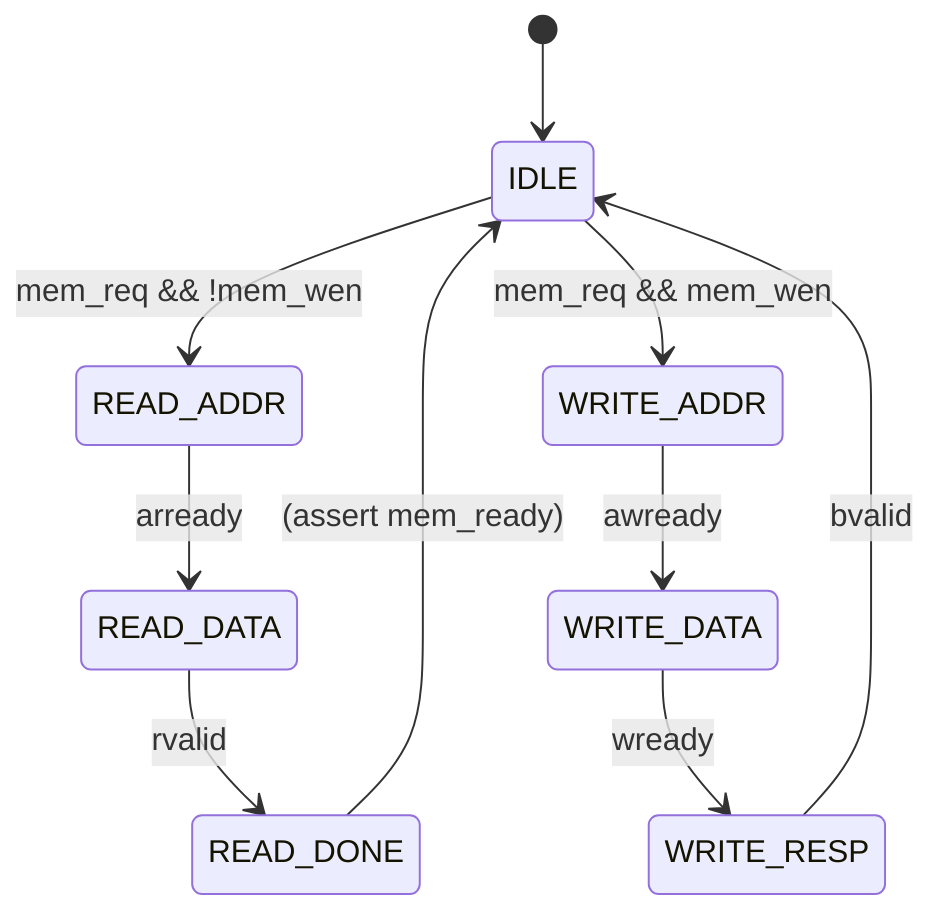

# Z-Core RISC-V Pipeline Architecture

## Overview

The Z-Core implements a **5-stage in-order stalling pipeline** for the RV32I instruction set. This document describes the complete pipeline architecture, data flow, hazard handling, memory interface, and implementation details.

---

## Pipeline Stages



### Stage Descriptions

| Stage | Function | Key Operations | Latency |
|-------|----------|----------------|---------|
| **IF** | Instruction Fetch | Read instruction via AXI-Lite, manage PC, handle fetch buffer | 10-11 cycles (AXI) |
| **ID** | Instruction Decode | Decode opcode, read register file, generate immediates, detect hazards | 1 cycle |
| **EX** | Execute | ALU operations, branch condition evaluation, target calculation | 1 cycle |
| **MEM** | Memory Access | Load/Store via AXI-Lite, byte/halfword extraction | 10-11 cycles (AXI) |
| **WB** | Writeback | Write results to register file | 1 cycle |

---

## Detailed Stage Architecture

### IF Stage (Instruction Fetch)

The IF stage manages instruction fetching with these key components:



**Key Features:**
- **Fetch Buffer**: Decouples fetch from pipeline stalls. If IF/ID is busy, fetched instruction goes to buffer.
- **PC Tracking**: `fetch_pc` register captures PC when fetch starts, ensuring correct PC association even if flush occurs mid-fetch.
- **Flush Handling**: On flush, both IF/ID and fetch buffer are invalidated, PC is redirected to target.

**Key Signals:**
| Signal | Description |
|--------|-------------|
| `fetch_wait` | Fetch operation in progress |
| `fetch_pc` | PC value for current fetch (captured at start) |
| `fetch_buffer_valid` | Fetch buffer contains valid instruction |
| `if_id_valid` | IF/ID register contains valid instruction |

### ID Stage (Instruction Decode)

The ID stage decodes instructions and handles data hazard detection:



**Forwarding to Decode:**
The decode stage can receive forwarded data for immediate use in ID/EX:

```verilog
dec_fwd_rs1 = (ex_mem_valid && ex_mem_rd == dec_rs1) ? ex_mem_alu_result :
              (mem_wb_valid && mem_wb_rd == dec_rs1) ? mem_wb_result :
              rf_rs1_data;
```

### EX Stage (Execute)

The EX stage performs ALU operations and evaluates branches:



**ALU Input Selection:**
```
alu_in1 = (LUI)   ? 0
        : (AUIPC) ? id_ex_pc
        :          fwd_rs1_data

alu_in2 = (I-type|Load|Store|LUI|AUIPC|Jump) ? immediate
        :                                       fwd_rs2_data
```

**Result Selection:**
```
ex_result = (LUI)        ? immediate
          : (AUIPC)      ? pc + immediate  
          : (JAL|JALR)   ? pc + 4          (return address)
          :                alu_out
```

### MEM Stage (Memory Access)

The MEM stage handles load/store operations with byte/halfword support:



**Load Data Extraction (Combinational):**
```verilog
always @* begin
    case (ex_mem_funct3)
        3'b000: mem_load_data = {{24{mem_rdata[byte_pos+7]}}, mem_rdata[...]}; // LB
        3'b001: mem_load_data = {{16{mem_rdata[hw_pos+15]}}, mem_rdata[...]};  // LH
        3'b010: mem_load_data = mem_rdata;                                      // LW
        3'b100: mem_load_data = {24'b0, mem_rdata[...]};                        // LBU
        3'b101: mem_load_data = {16'b0, mem_rdata[...]};                        // LHU
    endcase
end
```

> **Important**: `mem_load_data` is **combinational** (not registered) to ensure the correct data is available to WB on the same cycle `mem_ready` goes high.

### WB Stage (Writeback)

The WB stage writes results back to the register file:

```verilog
// Register file write condition
assign write_enable = mem_wb_valid && mem_wb_reg_write && 
                      mem_wb_rd != 5'b0 && !mem_wb_poisoned;
assign write_data = mem_wb_result;
assign write_addr = mem_wb_rd;
```

---

## Pipeline Registers



---

## Hazard Handling

### Data Forwarding

The pipeline implements full forwarding from EX/MEM and MEM/WB stages:



**Forwarding Logic (EX Stage):**
```verilog
fwd_rs1_data = (ex_mem_valid && ex_mem_reg_write && ex_mem_rd == id_ex_rs1_addr && ex_mem_rd != 0) 
                 ? ex_mem_alu_result :
               (mem_wb_valid && mem_wb_reg_write && mem_wb_rd == id_ex_rs1_addr && mem_wb_rd != 0) 
                 ? mem_wb_result :
                (mem_wb_valid && mem_wb_reg_write && mem_wb_rd == id_ex_rs1_addr && mem_wb_rd != 0) 
                  ? mem_wb_result :
                id_ex_rs1_data;
```

> **Critical Fix**: `mem_wb_reg_write` must be explicitly cleared when the pipeline stalls (inserting a bubble). Otherwise, stalled, invalid instructions in the pipeline could be interpreted as valid writes, causing incorrect forwarding of "ghost" data.


### Load-Use Hazard (Stall)

When a load is followed by an instruction that uses the loaded value:

```
LW  x2, 0(x1)     ; Load into x2
ADD x3, x2, x4    ; Uses x2 - STALL required!
```

**Detection:**
```verilog
load_use_hazard = id_ex_valid && id_ex_is_load &&
    ((id_ex_rd == dec_rs1 && dec_rs1 != 0) ||
     (id_ex_rd == dec_rs2 && dec_rs2 != 0 && uses_rs2));
```

**Action:** Stall IF, ID for 1 cycle; insert bubble in ID/EX.

### Control Hazards (Flush)

When a branch is taken or jump executes:



**Flush Actions:**
1. `if_id_valid <= 0` (invalidate delay slot)
2. `if_id_ir <= NOP` (safe instruction)
3. `fetch_buffer_valid <= 0` (clear buffer)
4. `PC <= next_pc` (redirect to target)
5. `fetch_wait <= 0` (cancel in-flight fetch)
6. Insert bubble in ID/EX stage

---

## Memory Interface

### Unified Memory Arbiter

The pipeline uses a single AXI-Lite master for both instruction fetch and data access:



**Arbiter Priority:**
```verilog
always @* begin
    if (mem_op_pending && !mem_ready) begin
        // Data access has priority
        mem_req = 1; mem_addr = ex_mem_alu_result;
    end else if (fetch_wait && !mem_ready) begin
        // Instruction fetch
        mem_req = 1; mem_addr = fetch_pc;
    end else begin
        mem_req = 0;
    end
end
```

### AXI-Lite Master State Machine



> **Note**: The `READ_DONE` state ensures `mem_rdata` is stable before `mem_ready` is asserted. This prevents timing issues where the consumer reads stale data.

### Memory Timing

```
Cycle:  1    2    3    4    5    6    7    8    9    10   11   12
        |----AXI Read Transaction (10 cycles)-----|
        IDLE ADDR DATA ........................... DONE IDLE
                                                    ↑
                                                 mem_ready
                                                 mem_rdata stable
```

---

## Pipeline Timing Diagrams

### Normal Instruction Flow

```
Cycle:    1    2    3    4    5    6    7    ...
I1:       IF   ID   EX   MEM  WB
I2:            IF   ID   EX   MEM  WB
I3:                 IF   ID   EX   MEM  WB
```

### With Multi-Cycle Fetch (11-cycle AXI latency)

```
Cycle:    1----11  12   13   14   15   16----26  27   28   29   30
I1:       IF        ID   EX   MEM  WB
I2:                 IF             ID   EX        MEM  WB
```

### Load-Use Stall

```
Cycle:    1----11  12   13   14----24  25   26
LW x2:    IF        ID   EX   MEM       WB
ADD x3,x2:          IF   [stall]  ID    EX   MEM  WB
```

### Branch Taken (Flush)

```
Cycle:    1----11  12   13   14   15----25  26   27   28   29
BEQ:      IF        ID   EX   MEM  WB
I+1:                IF   ××       (flushed)
Target:                  IF             ID   EX   MEM  WB
```

---

## Control Signals Reference

### Pipeline Control

| Signal | Description |
|--------|-------------|
| `stall` | Freezes IF, ID stages (load-use hazard or EX stall) |
| `flush` | Invalidates IF/ID, redirects PC (branch taken / jump) |
| `squash_now` | Set for one cycle after JAL/JALR enters ID/EX |
| `mem_stall` | Stalls when load/store in progress |
| `ex_stall` | Stalls EX when MEM is busy or waiting for AXI (`mem_stall` OR `mem_busy`) |

### Memory Control

| Signal | Description |
|--------|-------------|
| `fetch_wait` | Fetch operation in progress |
| `fetch_pc` | Captured PC for current fetch |
| `mem_op_pending` | Load/Store operation in progress |
| `mem_busy` | AXI master not in IDLE state |
| `mem_ready` | Memory operation complete, data valid |

### Valid/Poisoned Bits

| Signal | Description |
|--------|-------------|
| `*_valid` | Stage contains valid instruction to process |
| `*_poisoned` | Instruction should not write to register file |

---

## Supported Instructions

All RV32I instructions are fully supported:

| Category | Instructions | Status |
|----------|--------------|--------|
| **R-type** | ADD, SUB, AND, OR, XOR, SLL, SRL, SRA, SLT, SLTU | ✅ Working |
| **I-type (ALU)** | ADDI, ANDI, ORI, XORI, SLLI, SRLI, SRAI, SLTI, SLTIU | ✅ Working |
| **I-type (Load)** | LW, LH, LB, LHU, LBU | ✅ Working |
| **S-type (Store)** | SW, SH, SB | ✅ Working |
| **U-type** | LUI, AUIPC | ✅ Working |
| **J-type** | JAL, JALR | ✅ Working |
| **B-type** | BEQ, BNE, BLT, BGE, BLTU, BGEU | ✅ Working |

---

## Test Status

All 19 tests pass:

| Test | Description | Status |
|------|-------------|--------|
| 1 | Arithmetic (ADD, SUB, ADDI) | ✅ PASS |
| 2 | Logical (AND, OR, XOR) | ✅ PASS |
| 3 | Shifts (SLL, SRL, SRA) | ✅ PASS |
| 4 | Memory (LW, SW) | ✅ PASS |
| 5 | Compare (SLT, SLTU) | ✅ PASS |
| 6 | LUI/AUIPC | ✅ PASS |
| 7 | Fibonacci Integration | ✅ PASS |
| 8 | Branches (BEQ, BNE, BLT, BGE, BLTU, BGEU) | ✅ PASS |
| 9 | Jumps (JAL, JALR) | ✅ PASS |
| 10 | Backward Branch Loop | ✅ PASS |
| 11 | IO Access (UART/GPIO) | ✅ PASS |
| 12 | GPIO Bidirectional | ✅ PASS |
| 13 | Byte/Halfword Load/Store | ✅ PASS |
| 14 | UART Loopback | ✅ PASS |
| 15 | RAW Hazard Stress | ✅ PASS |
| 16 | Full ALU Coverage | ✅ PASS |
| 17 | Nested Loops | ✅ PASS |
| 18 | Memory Access Pattern Stress | ✅ PASS |
| 19 | Mixed Instruction Stress | ✅ PASS |

---

## File Structure

```
rtl/
├── z_core_control_u.v    # Main pipeline control unit (5-stage pipeline)
├── z_core_decoder.v      # Instruction decoder
├── z_core_alu.v          # Arithmetic Logic Unit
├── z_core_alu_ctrl.v     # ALU control signal decoder
├── z_core_reg_file.v     # 32x32 Register file
├── axil_master.v         # AXI-Lite master interface
├── axil_interconnect.v   # AXI-Lite interconnect (address routing)
├── axi_mem.v             # AXI-Lite RAM
├── axil_uart.v           # AXI-Lite UART
└── axil_gpio.v           # AXI-Lite GPIO

doc/
├── PIPELINE.md           # This file
├── PIPELINE_BUGS.md      # Educational guide to timing bugs found
└── Z_CORE_ARCHITECTURE.md # High-level architecture overview

tb/
└── z_core_control_u_tb.sv # Comprehensive testbench with 13 test cases
```

---

## Key Implementation Notes

### Critical Timing Fixes

The pipeline required several non-obvious timing fixes:

1. **IF/ID Consumption**: `if_id_valid` must be cleared when instruction advances to ID/EX
2. **Fetch PC Tracking**: `fetch_pc` captures address at fetch start, used when complete
3. **AXI Busy Check**: New fetches wait for `!mem_busy` to prevent overlap
4. **Combinational Load Data**: `mem_load_data` is combinational for same-cycle WB use
5. **STATE_READ_DONE**: AXI master ensures data stable before ready assertion
6. **Bubble Signal Clearing**: `reg_write` signals must be cleared when stalling to prevent incorrect forwarding.

For detailed explanations, see [PIPELINE_BUGS.md](PIPELINE_BUGS.md).

### Performance Characteristics

- **CPI (ideal)**: 10-11 cycles per instruction (dominated by AXI latency)
- **Branch Penalty**: 11+ cycles (flush + re-fetch)
- **Load Penalty**: 10-11 cycles for memory access
- **Forwarding**: Zero-cycle penalty for RAW hazards (except load-use)

---

## References

- [RISC-V Specification](https://riscv.org/specifications/)
- Patterson & Hennessy, "Computer Organization and Design: RISC-V Edition"
- [PIPELINE_BUGS.md](PIPELINE_BUGS.md) - Educational guide to timing issues found
